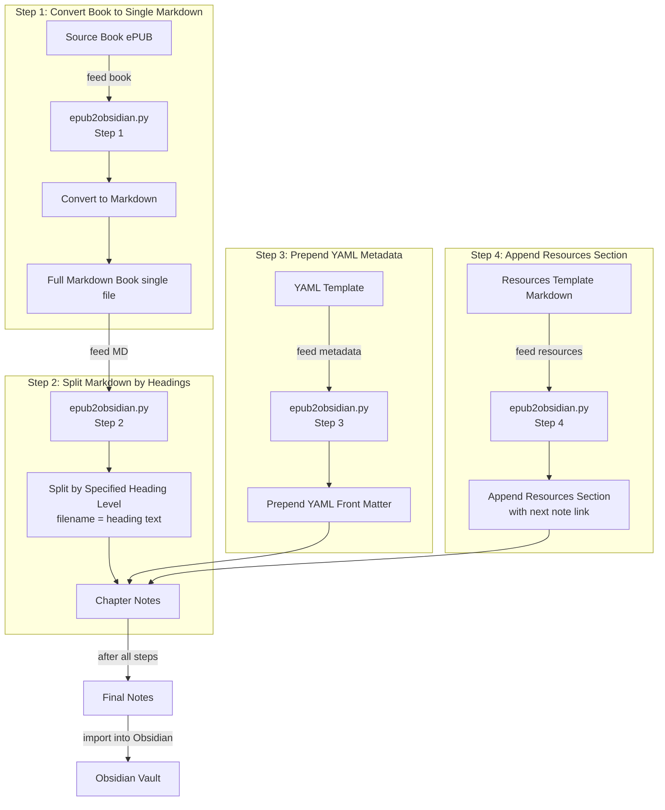

# ePUB to Obsidian Markdown Converter

A command-line tool that converts an ePUB file into a series of Obsidian-ready Markdown notes. The tool takes an input ePUB file, converts it into a single Markdown file (with media assets extracted), splits the Markdown file into individual note files based on a specified heading level, prepends YAML metadata, and appends a Resources section which includes a link to the next note. 

The notes are named according to the heading text (with illegal filename characters removed) for cleaner, human-readable file names.

## Features

- **Pandoc Conversion**: Uses Pandoc to convert ePUB (or PDF) files to Markdown, extracting images and other media.
- **Markdown Splitting**: Splits the Markdown file into individual notes based on a configurable heading level (e.g., H1 or H2).
- **Metadata Injection**: Prepends YAML front matter (from a template) to every note.
- **Resource Linking**: Appends a Resources section to each note, automatically inserting a link to the next note (using the placeholder `<NEXT_NOTE_LINK>`).
- **Customizable Filenames**: Note filenames are derived from the heading text instead of prefixed numbers or underscores.

## Flowchart

A flowchart of the project's code. 



## Repository Structure

```textfile
.
├── attachments/         # Directory where extracted media files are stored.
├── notes/               # Output directory for the generated Markdown notes.
├── templates/
│   ├── metadata.yml     # YAML metadata template. (EDIT THIS)
│   └── resources.md     # Resources Markdown template with <NEXT_NOTE_LINK> placeholder. (EDIT THIS)
├── test.epub            # Sample ePUB file (example).
├── test.md              # Intermediate Markdown output from Pandoc after running step 1.
└── epub2obsidian.py     # Main conversion pipeline script.
```

## Installation

1. **Clone the Repository:**

```bash
git clone https://github.com/YourUsername/epub2obsidian.git
   cd epub2obsidian
```

1. **Install Dependencies:**

    - Ensure you have [Pandoc](https://pandoc.org/installing.html) installed.
    - Python 3.6+ is required (only standard libraries are used).

## Usage

The tool accepts various command-line arguments:

- **Positional Arguments:**
    - `epub`: Path to the input ePUB file.
    - `outfile`: Path for the intermediate Markdown output generated by Pandoc.
- **Optional Arguments (with defaults):**
    - `--attachments` (default: `attachments`): Directory for extracted media.
    - `--metadata` (default: `templates/metadata.yml`): Path to the YAML metadata template.
    - `--resources` (default: `templates/resources.md`): Path to the Resources Markdown template.
    - `--outdir` (default: `notes`): Output directory for the final note files.
    - `--heading_level` (default: `1`): Heading level to use for splitting the Markdown (e.g., "1" for H1, "2" for H2).
- **Step Control (Mutually Exclusive Options):**
    - `--step-1`: Only perform Step 1 (conversion) and then exit.
    - `--no-step-1`: Skip Step 1 and run from Step 2 onward (useful if you've already converted the ePUB to Markdown).

### Example Commands

- **Run Full Pipeline (Steps 1–4):**

    ```bash
    python epub2obsidian.py mybook.epub mybook.md
    ```

- **Run Full Pipeline with Custom Paths and Heading Level:**

    ```bash
    python epub2obsidian.py mybook.epub mybook.md \
      --attachments my_custom_attachments \
      --metadata templates/custom_metadata.yml \
      --resources templates/custom_resources.md \
      --outdir my_notes \
      --heading_level 2
    ```

- **Perform Only the Conversion (Step 1):**

    ```bash
    python epub2obsidian.py mybook.epub mybook.md --step-1
    ```

*This is useful because you never know what the book is going to look like before converting it.*

- **Skip Conversion (Step 1) and Run Steps 2–4:**

    ```bash
    python epub2obsidian.py mybook.epub mybook.md --no-step-1
    ```

*After you clean up the section names and titles, you can then run this command.*

> [!bug]
> **TODO**: If we are using --no-step-1 flag, don't make the `--outfile` argument mandatory.

## Important Notes

- **Header Level Behavior:**
    When you use a heading level (e.g., H2) that is lower than the highest-level heading in the document (e.g., H1), any content before the first H2 (including H1 text) will not be included in any note. Consider inserting a dummy heading if you want to capture introductory content.

## Disclaimer

**Legal Disclaimer:**
This tool is intended for educational and personal use only. Copying, converting, and distributing copyrighted material without explicit permission from the author or publisher is illegal. **You must have the right to modify or convert the content you process using this tool.** The authors of this repository are not responsible for any misuse of this software.

## Contributing

Contributions, issues, and feature requests are welcome! Please open an issue or submit a pull request if you have any ideas or improvements.

## License

This project is licensed under the terms of the MIT License.
